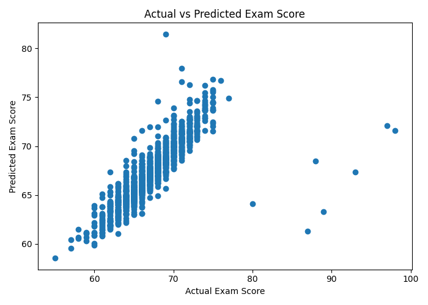
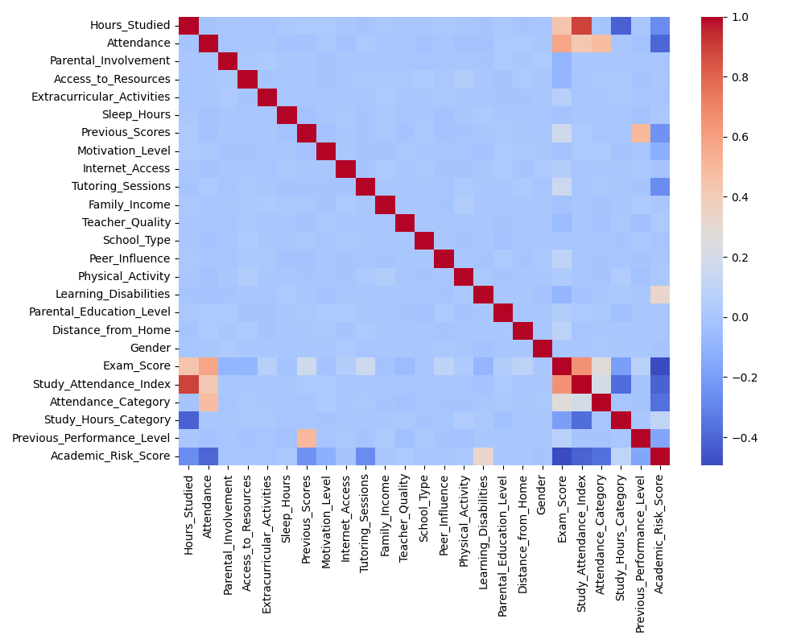
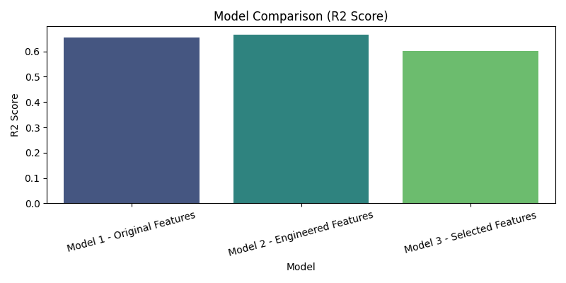

# Student Performance Prediction & Feature Engineering Analysis

An end-to-end Machine Learning project analyzing student academic performance and comparing Random Forest regression performance across baseline, feature-engineered, and feature-selected datasets.

## Project Overview
* **Goal**: Predict continuous student exam scores based on demographic, behavioral, and academic features.
* **Dataset**: 6,607 student records with 20 original attributes.
* **Algorithm**: Random Forest Regressor (`n_estimators=100`).

## Key Features Engineered
1. **`Study_Attendance_Index`**: Interaction feature combining study hours and attendance proportion.
2. **`Attendance_Category`**: Binned performance levels (`Poor`, `Average`, `Good`, `Excellent`).
3. **`Study_Hours_Category`**: Grouped study intensity (`Low`, `Medium`, `High`, `Very High`).
4. **`Previous_Performance_Level`**: Categorization of historical scores.
5. **`Academic_Risk_Score`**: Cumulative index (0–6) quantifying attendance, study, and learning disability risks.

## Model Performance & Comparison

| Model | MAE | MSE | RMSE | R² Score |
|---|---|---|---|---|
| **Model 1: Baseline (Original Features)** | 1.1314 | 4.8817 | 2.2095 | 0.6546 |
| **Model 2: Engineered Features (Best)** | **1.0909** | **4.7299** | **2.1748** | **0.6654** |
| **Model 3: SelectKBest Features (k=10)** | 1.3033 | 5.6265 | 2.3720 | 0.6020 |

### Findings
* **Feature engineering improved model predictive capacity**: Incorporating interaction and risk variables raised the $R^2$ score from `0.6546` to `0.6654`.
* **Top predictors**: `Study_Attendance_Index` contributed the highest feature importance (~43.6%), followed by `Attendance` (~18.3%) and `Previous_Scores` (~7.3%).
* **Feature selection reduced performance**: Dropping features via `SelectKBest` degraded the $R^2$ score to `0.6020`, indicating non-linear interactions across the full feature set were crucial for the Random Forest trees.

## Visualizations

| Actual vs Predicted Scores | Feature Correlation | Model Comparison |
| :---: | :---: | :---: |
|  |  |  |

## Repository Structure
```text
student-performance-prediction/
│
├── README.md
├── student_performance.ipynb
├── requirements.txt
├── data/
│   └── student_performance.csv
├── images/
│   ├── correlation.png
│   ├── actual_vs_predicted.png
│   └── model_comparison.png
└── src/
    └── model.py
